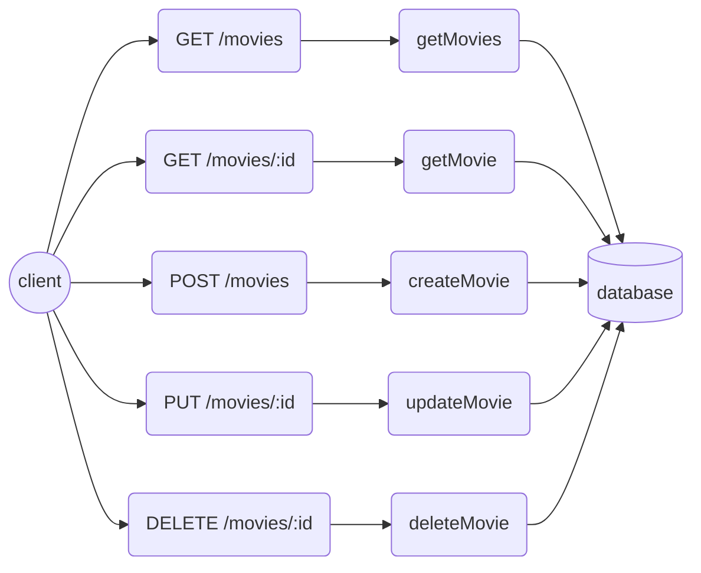

# crud-api-with-go
Building a CRUD API with Golang

```mermaid
graph LR
i((client)) --> get_movies(GET /movies) --> getMovies
i((client)) --> get_movie(GET /movies/:id) --> getMovie
i((client)) --> post_movie(POST /movies) --> createMovie
i((client)) --> put_movie(PUT /movies/:id) --> updateMovie
i((client)) --> delete_movie(DELETE /movies/:id) --> deleteMovie
getMovies(getMovies) --> database
getMovie(getMovie) --> database
createMovie(createMovie) --> database
updateMovie(updateMovie) --> database
deleteMovie(deleteMovie) --> database
database[(database)]
```

Run application with `go run main.go`
